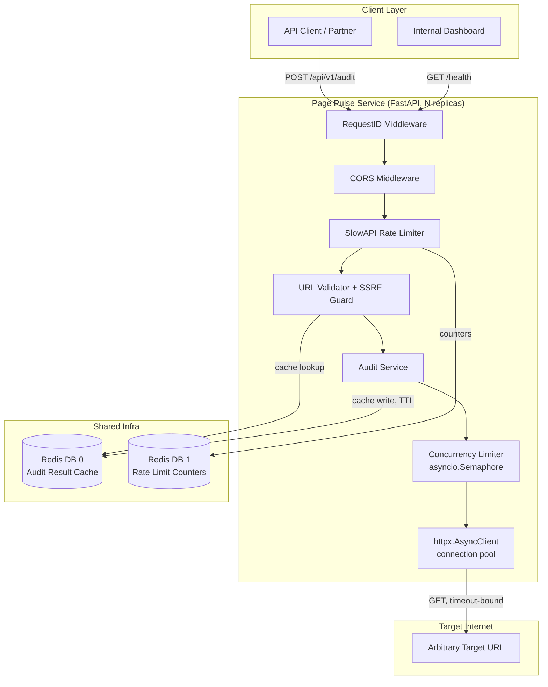
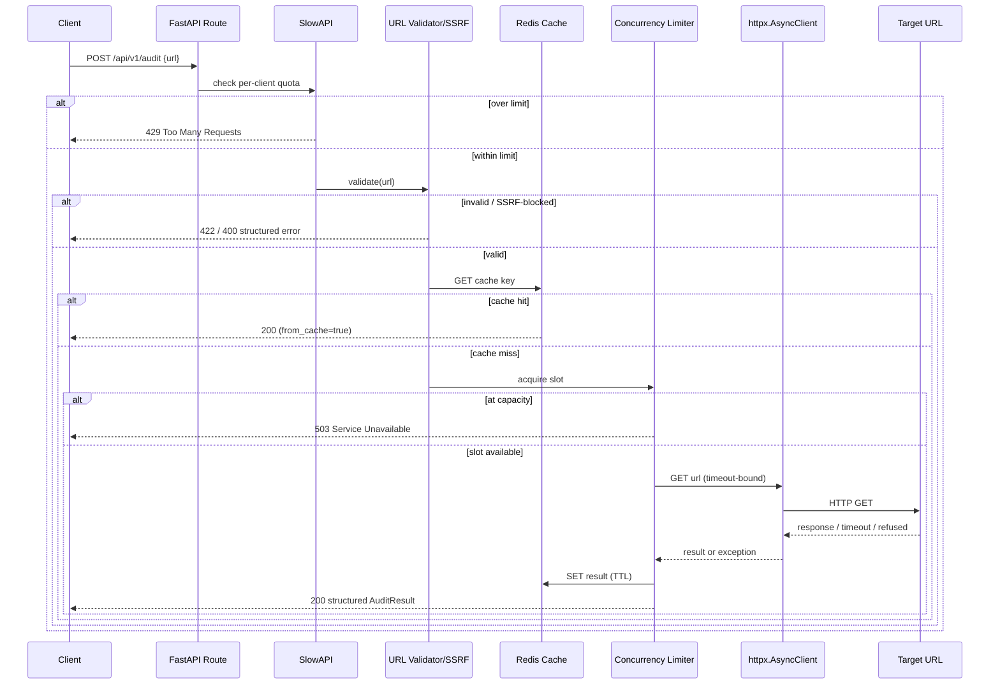

# Page Pulse — System Architecture

## 1. Overview

Page Pulse is a stateless, horizontally-scalable FastAPI service that
accepts a URL, performs a live HTTP audit of it (status, timing,
redirects, security headers), and returns a structured report. It is
built around four cross-cutting concerns layered onto a small
domain core:

1. **Validation & safety** — structural URL validation plus an SSRF
   guard that resolves DNS and rejects private/reserved networks.
2. **Resilience** — timeouts, a bounded concurrency limiter, and
   per-client rate limiting so one noisy caller (or one slow target
   site) cannot degrade the service for everyone else.
3. **Performance** — a Redis-backed, TTL'd cache so repeated audits
   of the same URL within a window are served without a new
   outbound request.
4. **Observability** — structured JSON logs correlated by a
   request id, plus a health endpoint that reports dependency status.

## 2. Component Diagram

## 3. Data Flow (single audit request)

## 4. Request Lifecycle, in prose

1. **Ingress** — the request hits `RequestIDMiddleware`, which
   assigns (or propagates) an `X-Request-ID`, binds it to a
   `contextvars.ContextVar`, and logs a structured `http_request`
   access-log line on the way out (method, path, status, latency).
2. **CORS** — standard preflight/actual-request handling.
3. **Rate limiting** — SlowAPI checks the caller's quota (keyed by
   `X-API-Key` if present, else source IP) against Redis-backed
   counters. Over-limit requests short-circuit with `429` before any
   business logic runs.
4. **Validation** — `validate_url_structure` checks scheme, length,
   and hostname shape; `enforce_ssrf_guard` resolves the hostname via
   DNS and rejects private/loopback/link-local/reserved targets. Both
   run **before** any cache lookup or outbound call, so a malformed
   or disallowed URL never counts against the outbound quota.
5. **Cache lookup** — if enabled and requested, Redis is checked for
   a fresh result under the normalized URL as key.
6. **Concurrency admission** — a process-wide `asyncio.Semaphore`
   caps in-flight outbound audits; if saturated, the request fails
   fast with `503` rather than queuing (queuing would let latency
   balloon unpredictably under load — see §5, Queue Strategy).
7. **Live fetch** — `httpx.AsyncClient` (shared, connection-pooled)
   issues the GET with independent connect/read timeouts, following
   redirects up to a configured maximum.
8. **Result assembly & cache write** — status, timing, redirect
   count, content metadata, and a security-header breakdown are
   assembled into `AuditResult`, then written to cache with the
   configured TTL.
9. **Response** — the structured JSON result (or a structured JSON
   error, on any failure branch) is returned, tagged with the
   request id.

## 5. Queue Strategy

Page Pulse **intentionally does not use a task queue** (Celery,
RQ, SQS-backed workers) for the audit path — the request is
synchronous end-to-end. This is a deliberate trade-off:

**Why synchronous, not queued:**
- An audit's useful lifetime is measured in seconds
  (`request_timeout_seconds`, default 8s) — well within a single
  HTTP request/response cycle. Queueing adds latency (enqueue, worker
  pickup, result polling) for no benefit at this scale.
- The client wants the result to render a report *now* — polling for
  an async job id is worse UX for a sub-10-second operation.
- Concurrency is already bounded in-process (the semaphore), so a
  queue's main benefit — smoothing bursts — is achieved more simply
  here with load-shedding (`503`) plus client-side retry with
  backoff.

**Where a queue *would* earn its place** (documented for future
scaling, not built): if Page Pulse grows a **bulk/batch audit**
feature (e.g. "audit these 500 URLs from a sitemap"), that is a
natural queue candidate:
- API enqueues N `AuditJob` messages to Redis Streams or SQS.
- A pool of stateless worker processes (reusing `AuditService`
  as-is) drains the queue, respecting the same concurrency limiter
  and cache.
- Job status is polled via a `GET /api/v1/audit-jobs/{id}` endpoint
  backed by a small Postgres/Redis job-status table.

This keeps the synchronous single-URL path simple and fast today,
while giving a clear, low-risk extension point for bulk workloads
later without redesigning the core `AuditService`.

## 6. Why this shape (Clean Architecture / SOLID notes)

- **Single Responsibility**: `AuditService` only answers "what does
  auditing this URL look like right now" — it knows nothing about
  HTTP status codes for the *inbound* request, rate limiting, or
  FastAPI. `url_validator.py` only validates. `cache.py` only caches.
- **Dependency Inversion**: `AuditService` depends on an injected
  `httpx.AsyncClient`, `AuditCache`, and `ConcurrencyLimiter` —
  never constructs them — so tests substitute `respx`-mocked clients
  and `fakeredis` without touching the class itself.
- **Open/Closed**: new checks (e.g., TLS certificate expiry, a
  robots.txt check) are added as new fields on `AuditResult` and new
  private methods on `AuditService`, without changing the route,
  the caching layer, or the concurrency layer.
- **Interface Segregation**: routes depend only on the thin
  `AuditService.audit()` surface; they never reach into Redis or
  httpx directly.
